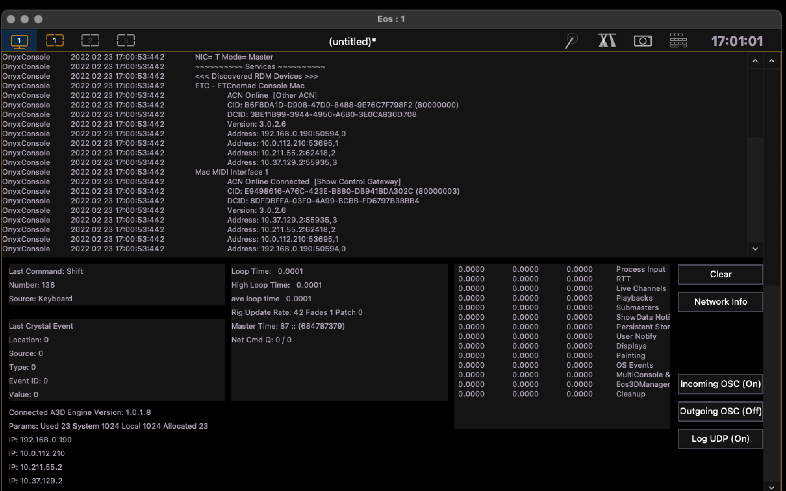

# Integrating QLab with Nomad Via OSC

## Rationale

The purpose of this document is to describe how to configure QLab and
ETCnomad so that Nomad cues are triggered from QLab. Among the
reasons this might be desirable are:

* Simplified board operation: with only one cue stack, lights and
  sound (and video, &c.) can be triggered from one list, eliminating
  the need for an operator to monitor two different applications or
  multiple operators to maintain synchronization.

* Cues can be programmed in sync. For intance, light cues can fire at
  precise moment in a sound cue.

* Separation of technical responsibilities: the lighting designer can
  concern themselves with creating looks and the QLab programmer with
  when to fire those looks.

## Networking

Because this is such a broad topic that spans network types and
operating systems, we will content ourselves with some general
comments and not delve into how to configure networks. There is an
absolute requirement that the QLab and Nomad hosts must be able to
communicate over a network, that network can be wired or wireless as
appropriate.

It appears to be the case that the Nomad host must have an external
network and does not listen on the loopback address ("localhost" or
127.0.0.1).

> Note: MacOS will not assign an IP address at all unless (a) there's
> an ethernet cable attached or (b) wifi is enabled and connected to
> an access point.  Because MacOS will self-assign IP addresses, it's
> sufficient to run an ethernet cable into a hub.

On the Nomad console there are two means of determining what IP
address the console is receiving data on:

  * From the EOS Family Welcome Screen choose "Settings" then
    "Network." The IP address Nomad will listen on is listed as "IP
    address".

    

  * In Nomad visit the "Diagnostics" tab (Tab 99) then click "Network
    Info". The address will be listed as "Address" on the display.

    

## Nomad Setup

To configure the incoming OSC setup, first choose "Setup" -> "System"
-> "Show Control" -> "OSC". Ensure the "OSC RX" value is set to
"Enabled". Now choose a port to listen on ("OSC RX Port"), we'll
use 9000. Then provide an "OSC Cue Recv String", we'll use
`/go/%1` here.

With this configuration in place, Nomad will expect messages like
`/go/%1` on port 9000 on the IP address noted above.


## QLab Setup

In QLab, go to the "Settings" page ("Window" -> "Workplace Settings")
and choose the "Network" tab. We're going to define a Network Cue
Destination Pagh. In this example, we call the patch "Nomad". Type
retains its default value of "address" and Network can usually be
defined as "Automatic". The Destination should be the IP address of
the Nomad and the Port setting should be the port configured above
(here, 9000).


With that Network Patch configured, a new Network Cue can be
created. Cmd-8 will create a new Network Cue. Here you will provide a
Name attribute (we like to include the Nomad cue number as part of our
name, e.g., "[99] Blackout"). Choose the "Settings" tab and specify:


| Destination: | Nomad ("Nomad" is the name of our Destination Patch) |
| Type:	| OSC message |
| Fade:	| No Fade |

In the textbox, provide the string to send. If we want to fire Nomad
cue 99, that string will be `/go/99`.

## Testing

On the Nomad, bring up the Diagnostics console and ensure that
incoming OSC messages are being displayed. Ensure that "Incoming OSC"
is "(On)".  In QLab, fire the network cue. When the message is
received by Nomad, you'll see a message like

```
[OSC Packet] /go/99
```

(and if you have a Nomad cue 99, it will fire).


## Troubleshooting

Although this setup has proven extremely reliable (on a wired network)
across numerous productions there are some potential gotchas.

  * The IP address must be correct in QLab.

  * The RX port (Nomad) and TX port (QLab) must match.

  * The receive string must match the send string.

  * Incoming OSC must be logging (if you're watching the diagnostics
    console for the OSC packet anyway).

Using a generally available public wifi network is not recommended
although I've had plenty of success on a private wifi network (when I
controlled all aspects of its configuration).  Specifically, watch out
that you're not assigned new DHCP addresses each time you boot.

I've also had issues where the ETCnomad Shell reports the correct IP
address but the console doesn't recognize it.  I don't (yet) know what
the cause of this is but it's frustrating.  Rebooting everything seems
to clear up the problem.

## Author

  Bunny Lushington; February 2022
