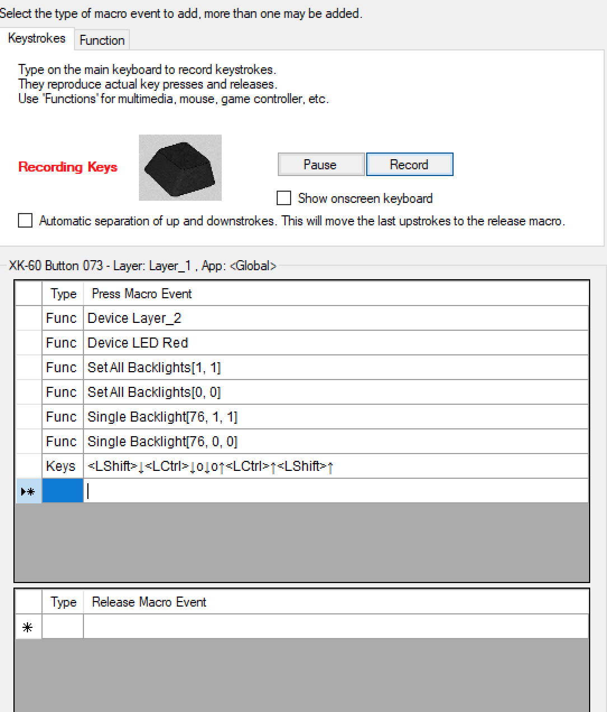
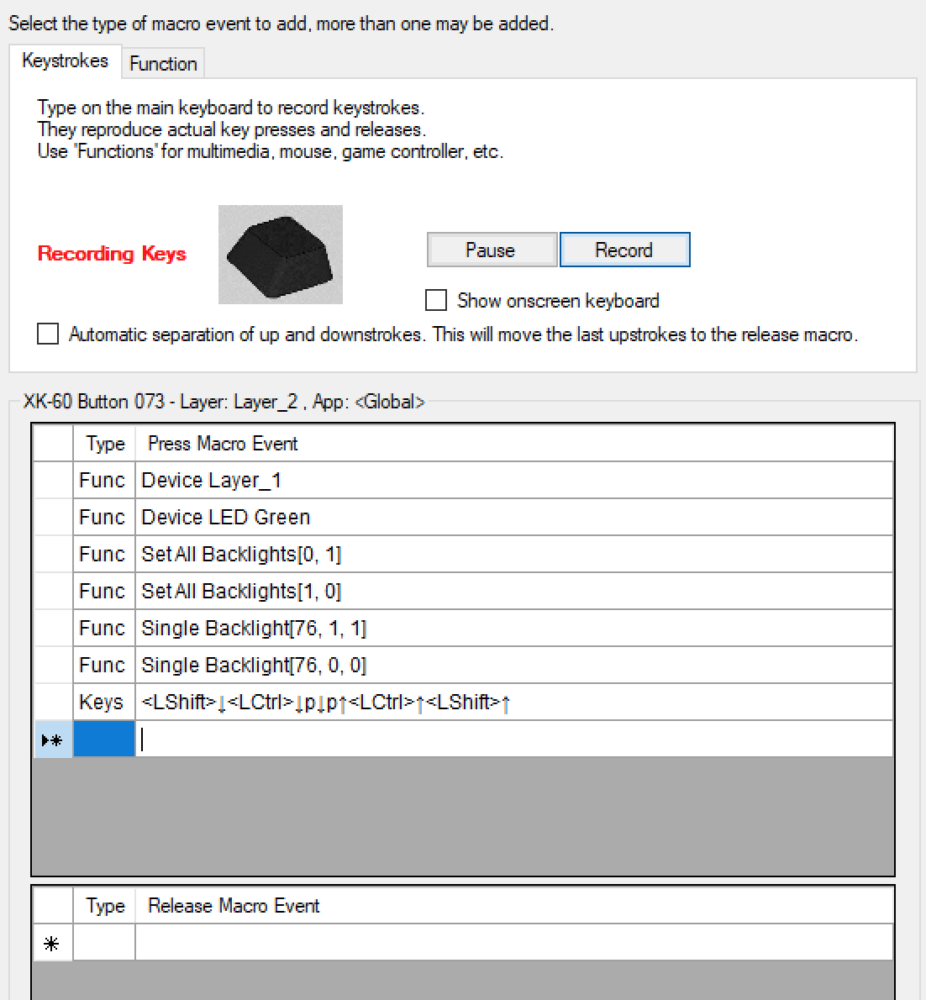

# Toggling Between Nomad and QLab

## Rationale

The Xkeys XK-60 has two "layers" whereby a physical key will send one
key combination when layer one is active and a different combination
when layer two is active.  I've configured layer one to map to QLab
shortcuts and layer two to map to Nomad shortcuts.

Additionally, the green LED lights up and the key backlighting is blue
for layer one; the red LED lights up and the backlighting is red for
layer two. I find this a good visual aid in knowing what to expect.

I wanted a key to not only toggle between layers but also bring the
appropriate application to the foreground.  To achieve this, I
leveraged MacOS Services.

> Note: It's possible to switch from QLab to Nomad by using a QLab
> script cue; however, Nomad cannot execute arbitrary Applescript.  To
> keep things symmetrical, I've opted for MacOS Services in both
> directions.

## Implementation Plan

I've created two Services, `EOS to Front` and `QLab to Front` using
the MacOS Automator.app to create "Quick Actions".  With these
installed in `~/Library/Services` I then created two Keyboard
Shortcuts via the Keyboard -> Shortcuts System Preferences pane.

With these in place, it's possible so use MacroWorks to define a key to:

  * switch layers (1 -> 2 or 2 -> 1)
  * set the backlight color
  * send the appropriate keyboard shortcut to fire the Service

(I also ensure that they key I have defined for Panic/Stop has its red
backlight set correctly after resetting the backlight.  Because I run
shows in QLab mode -- when I'm most likely going to need to find the
panic key quickly -- I'm okay with it being matching the red
backlighting of the Nomad layer.)

## Details

### Service Workflows

The two workflows can be found in the `workflows` subdirectory in the
repository and should be editable with the Automator.app.

Here's the text of `EOS to Front` (QLab to Front is nearly identical):

``` applescript
on run {input, parameters}

	tell application "Eos Family"
		activate
	end tell

	return input
end run
```

### Keyboard Shortcuts

I've mapped the Services like

| Key Chord | Service |
| --- | --- |
| Shift-Control-P | QLab to Front |
| Shift-Control-O | EOS to Front |

You can do this either in the System Preferences application or via
the command line with:

``` shell
defaults write pbs NSServicesStatus -dict-add \
  '"(null) - QLab to Front - runWorkflowAsService"' '{key_equivalent = "^$p";}'
defaults write pbs NSServicesStatus -dict-add \
  '"(null) - EOS to Front - runWorkflowAsService"' '{key_equivalent = "^$o";}'
```

### MacroWorks Configuration

Layer One (Qlab/blue):


Layer Two (Nomad/red):



## Disclaimer

THE SOFTWARE IS PROVIDED “AS IS”, WITHOUT WARRANTY OF ANY KIND,
EXPRESS OR IMPLIED, INCLUDING BUT NOT LIMITED TO THE WARRANTIES OF
MERCHANTABILITY, FITNESS FOR A PARTICULAR PURPOSE AND
NONINFRINGEMENT. IN NO EVENT SHALL THE AUTHORS OR COPYRIGHT HOLDERS BE
LIABLE FOR ANY CLAIM, DAMAGES OR OTHER LIABILITY, WHETHER IN AN ACTION
OF CONTRACT, TORT OR OTHERWISE, ARISING FROM, OUT OF OR IN CONNECTION
WITH THE SOFTWARE OR THE USE OR OTHER DEALINGS IN THE SOFTWARE.

## Author

Bunny Lushington; February 2022
